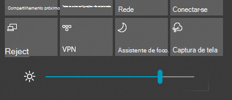

# Alterar o brilho da tela no Windows 10

Se o seu Windows 10 for mais recente do que a versão 1903, possui um **controle deslizante de brilho** na central de ações. Para abrir a central de ações, clique no botão **Notificação**, no canto mais à direita da barra de tarefas, ou pressione **página inicial do Windows + A** no teclado.

Se o seu Windows 10 é uma versão anterior, você pode encontrar o controle deslizante de brilho indo para **[Configurações > Sistema > Exibir](ms-settings:display?activationSource=GetHelp)**.

**Observações**:

- Talvez você não veja Alterar brilho para o controle deslizante de exibição interno em PC desktop com um monitor externo. Para alterar o brilho de um monitor externo, use os controles no monitor.
- Se você não tiver um PC desktop e o controle deslizante não aparecer ou funcionar, tente atualizar o driver de vídeo. Na caixa de pesquisa na barra de tarefas, digite **Gerenciador de Dispositivos**e, em seguida, selecione **Gerenciador de Dispositivo** na lista de resultados. No **Gerenciador de dispositivos**, selecione **Adaptadores de vídeo**, em seguida, selecione o adaptador de vídeo. Mantenha pressionada a tecla (ou clique com o botão direito do mouse) no nome do adaptador de vídeo e clique em **Atualizar driver**; em seguida, siga as instruções.
